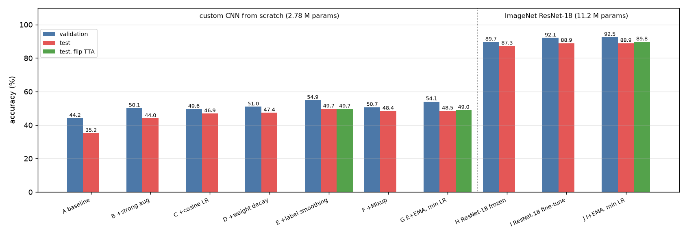
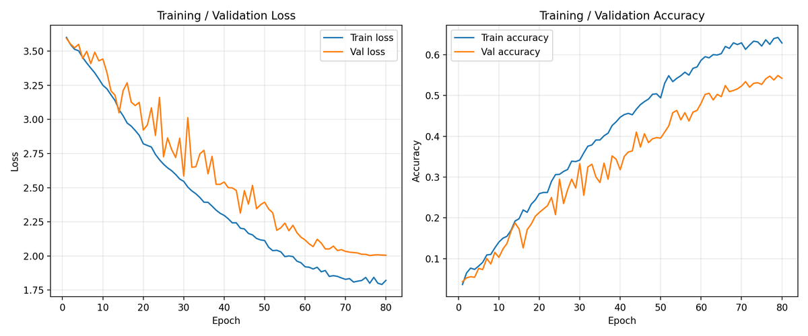
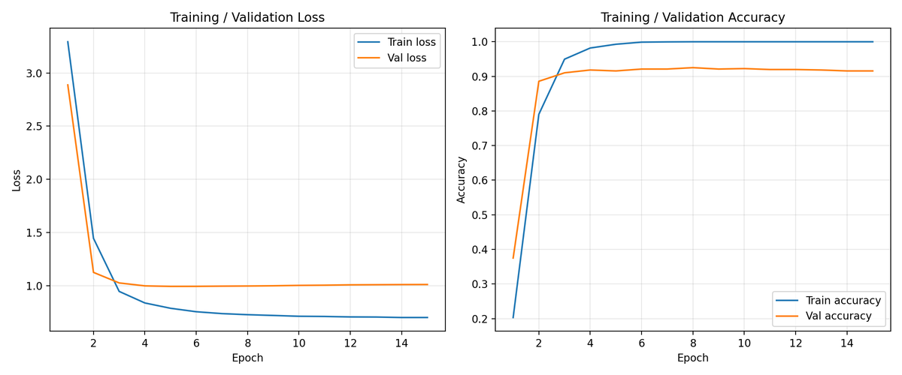
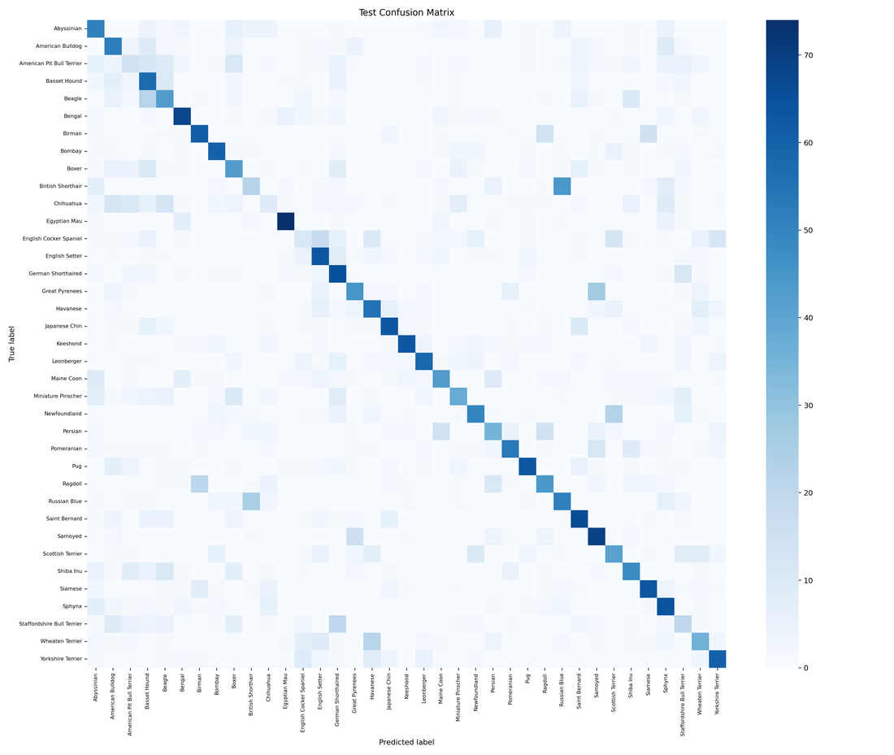
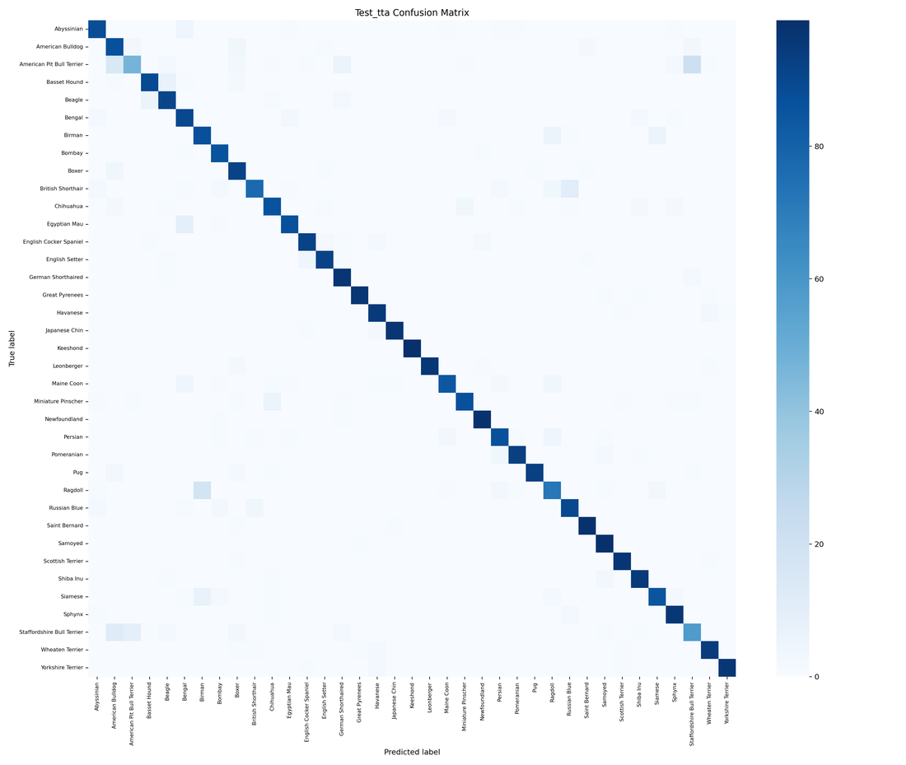
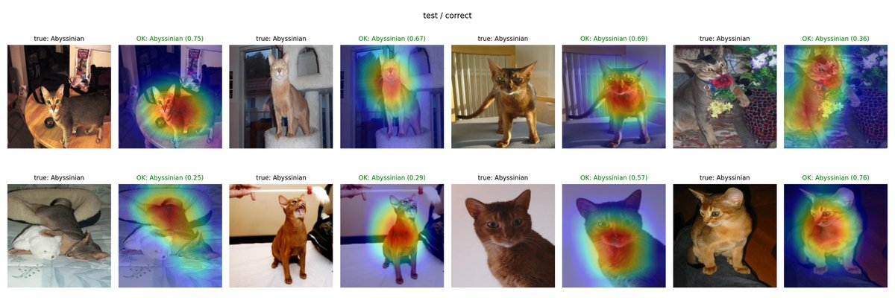

# Oxford-IIIT Pet Classification

[](https://github.com/asher0913/oxford-pet-classification/actions/workflows/ci.yml)


Fine-grained classification of 37 cat and dog breeds, about 80 training images per class. This
PyTorch project compares two models on the same split and pipeline:

- **PetResNet**, a 2.78 M-parameter residual CNN with squeeze-and-excite attention, trained from
  scratch;
- **ResNet-18** pretrained on ImageNet, either as a frozen feature extractor or fully fine-tuned
  with differential learning rates.

A progressive ablation adds one training technique per row, so each change in accuracy can be
traced to a single technique.

**Headline:** the fine-tuned ResNet-18 reaches **89.8% test accuracy** (EMA + flip TTA). The
from-scratch PetResNet reaches **49.7%**, 18× chance, with no pretraining, segmentation masks or
extra data.



## Results

The trainval split (3,680 images) is split 80/20 into train and validation with a fixed seed.
Checkpoints are selected on validation, and the official test split (3,669 images) is scored
once per run, at the end.

| Row | Run | Change from the previous row | Val | Test | Test, flip TTA |
|---|---|---|---:|---:|---:|
| A | custom baseline | no augmentation, constant LR | 44.16% | 35.19% | |
| B | | + strong augmentation (RandomResizedCrop, TrivialAugmentWide, RandomErasing) | 50.14% | 43.99% | |
| C | | + 3-epoch warm-up, cosine LR | 49.59% | 46.88% | |
| D | | + weight decay 1e-4 | 50.95% | 47.40% | |
| **E** | **best from scratch** | + label smoothing 0.1 | **54.89%** | **49.69%** | 49.66% |
| F | | + Mixup α = 0.2 | 50.68% | 48.41% | |
| G | | E + EMA, cosine LR floor, TTA | 54.08% | 48.49% | 48.98% |
| H | ResNet-18, frozen backbone | only the 19 k-parameter head trains | 89.67% | 87.30% | |
| I | ResNet-18, full fine-tune | backbone LR 1e-4, head 1e-3 | 92.12% | 88.93% | |
| **J** | **best overall** | I + EMA, cosine LR floor | **92.53%** | 88.91% | **89.78%** |

Custom-CNN runs train for 80 epochs; ResNet-18 runs for 15. The full sweep of ten runs takes
about 40 minutes on one RTX 5880 Ada.

- **Augmentation is the biggest lever.** Going from A to B adds 8.8 points of test accuracy.
  With about 80 images per class, a from-scratch CNN memorises the training set without it.
- **The cosine schedule helps test accuracy, not validation.** It costs 0.5 points of validation
  accuracy (C vs. B) and gains 2.9 points on test; the 736-image validation split is too small
  to show it. Weight decay and label smoothing then add 0.5 and 2.3 points.
- **Mixup hurts on small fine-grained data.** It costs 4.2 points of validation and 1.3 of test
  accuracy (F vs. E). Interpolating two breeds blurs cues that are already subtle.
- **EMA and TTA only help when they fit the setting.** With decay 0.9999 the EMA window
  (~10,000 steps) is longer than the whole custom run (3,680 steps), so the shadow weights lag
  (52.2% vs. 54.1% raw validation); row G reports the raw checkpoint. Flip TTA does nothing for
  the custom CNN, which already learned flip invariance from augmentation. It adds 0.87 points
  to the fine-tuned ResNet-18, which had not.
- **Pretraining is worth about 40 points here.** ResNet-18 starts from 1.28 M ImageNet images;
  PetResNet sees 2,944.

| Custom CNN (E): training curves | ResNet-18 (J): training curves |
|---|---|
|  |  |

| Custom CNN (E): test confusion matrix | ResNet-18 + TTA (J): test confusion matrix |
|---|---|
|  |  |

Most of ResNet-18's remaining errors are between breeds people also confuse: Ragdoll and Birman,
American Pit Bull and Staffordshire Bull Terrier, British Shorthair and Russian Blue. The
from-scratch model's errors are spread more widely, even between less similar breeds. Grad-CAM
from the last convolutional stage (implemented from scratch in `gradcam.py`) shows ResNet-18
attending to the head and body, not the background:



## Model

| Stage | Layers | Output |
|---|---|---|
| Stem | Conv3×3(32), BN, ReLU (stride 1) | 224² × 32 |
| Stage 1 | 2 × ResBlock(32→64), first with stride 2 | 112² × 64 |
| Stage 2 | 2 × ResBlock(64→128) + squeeze-and-excite | 56² × 128 |
| Stage 3 | 2 × ResBlock(128→256) + squeeze-and-excite | 28² × 256 |
| Head | global average pool, dropout 0.3, Linear(256, 37) | 37 |

The stride-1 stem keeps fine detail (ear shape, facial structure, fur pattern) that separates
similar breeds. Downsampling happens inside the first block of each stage. Squeeze-and-excite
gating sits only in the deeper stages, where channels carry semantic features. Global average
pooling keeps the classifier at 9.5 k parameters.

## Usage

```bash
pip install torch torchvision --index-url https://download.pytorch.org/whl/cu121   # match your CUDA
pip install -r requirements.txt && pip install -e .

python scripts/run_recommended_experiments.py            # all ten runs, then the summary chart and Grad-CAM grids
python scripts/run_recommended_experiments.py --only custom_baseline custom_aug --custom-epochs 10
python scripts/run_recommended_experiments.py --dry-run  # print the commands
```

One run, for example the best fine-tuned model (row J):

```bash
python -m pet_classifier.train --experiment-name transfer_resnet18_finetune_ema \
  --model resnet18 --pretrained --image-size 224 --batch-size 32 --epochs 15 --augmentation basic \
  --optimizer adamw --lr 1e-4 --head-lr-mult 10 --weight-decay 1e-4 --scheduler cosine --warmup-epochs 1 \
  --label-smoothing 0.1 --ema --ema-decay 0.999 --min-lr 1e-5 --tta --download --amp --test-at-end
```

Re-score a checkpoint, render prediction and Grad-CAM grids, or predict on your own images:

```bash
python -m pet_classifier.evaluate  --checkpoint outputs/<run>/best_model.pt
python -m pet_classifier.visualize --checkpoint outputs/<run>/best_model.pt --split test --filter incorrect
python -m pet_classifier.predict   --checkpoint outputs/<run>/best_model.pt --input photos/ --top-k 5
```

Each run writes `outputs/<name>_<timestamp>/` with:

- the best, last and (with EMA) raw checkpoints;
- `run_config.json` and `history.csv`;
- training curves;
- validation and test confusion matrices, classification reports and per-class accuracy;
- `summary.json`.

The sweep adds `outputs/ablation_summary.{csv,json}` and a chart. Checkpoints are not committed;
see `weights/README.md`.

**Without internet on the training machine**, download `images.tar.gz` and
`annotations.tar.gz` from the [dataset page](https://www.robots.ox.ac.uk/~vgg/data/pets/). Extract
them into `data/oxford-iiit-pet/`, so that `images/*.jpg` and `annotations/trainval.txt` exist.

## Implementation notes

- **EMA with bias-corrected decay.** The decay is `min(decay, (1 + n) / (10 + n))`. A fixed 0.999
  from the first step left about 2.5% of the random initialisation in the shadow weights and cost
  about 7 points of validation accuracy. `tests/test_model_ema.py` locks the schedule in, and
  also checks that integer BatchNorm buffers are copied, not averaged.
- **No test-set model selection.** The test split is scored only with `--test-at-end`, after
  the best-validation checkpoint is chosen.
- **Deterministic splits.** The seed is 42; `--deterministic` also fixes cuDNN algorithms.
- The code is in `src/pet_classifier/`: `data`, `models` (PetResNet and the transfer wrappers
  with differential learning rates), `train`, `evaluate`, `predict`, `visualize`, `gradcam`, `ema`
  and `utils`.

## Limitations

- One seed per run. The differences between neighbouring custom-CNN rows (about 0.5 to 3
  points) have no confidence intervals and may not all survive re-running.
- The custom CNN is still under-trained at 80 epochs, with training accuracy around 63%. A longer
  schedule, where EMA could also start to help, is the obvious next step.
